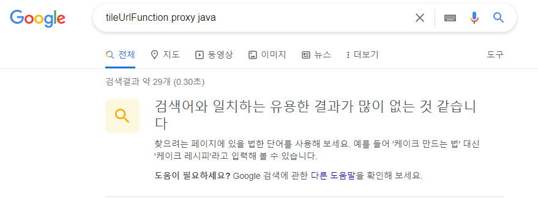

## [Proxy] 
OpenLayers 라는 자바스크립트 라이브러리와 GEOSERVER 를 이용하고 있었는데 이것들을 이용한 프록시 개발 과정이다.
  
### 이슈발생
개발중인 웹에서 지도를 사용해야하는데 서비스중인 웹은 SSL을 사용하지만 지도정보를 가진 서버는 SSL을 사용할수없어서 프록시 기능을 개발하게 됬다.  
브라우저는 리소스를 가져올때 프로토콜이 다르면 mixed-content 경고와 함께 프로토콜을 클라이언트 기준으로 변경한다.  ( 추후에  CORS 이슈까지 발생하면서 HTTP보안에 대한 무지한 자신을 알게됬다. )

### 잘못된 판단
1. 브라우저에 경고창들을 보면서 서론 다른 프로토콜이 보안상 위험하다는 것을 보고  
프로토콜을 맞추지 않는 한 통신이 불가하다고 생각했다.  
(브라우저는 보안상 예외처리를 했던거고 통신은 가능했다.)
2. 통신이 가능하다는것을 알고 백엔드에서 자원을 가져왔지만 OpenLayers처럼 동적인 자원을 가져오진 못했다.
3. 대충 키워드를 검색하면 구글이 개발해줄 줄 알았다.

### 해결방안
1. 길을 헤맨다.  

여러가지 키워드를 검색했다.   
'openlayers proxy', 'openlayers proxy 자바', 'openlayers bypass', 'openlayers proxy exsample' 등   

검색하다보니 처음보는 구글알림까지 봤다.  
그러다 우연히 저 사진에있는 'tileUrlFunction' 이라는 OpenLayers 에서 지원하는 기능을 찾게된다.  
하지만 Doc를 읽어도 무슨 기능인지 도통 감이 오질 않았다.  
이해를 하려하지않고 대략적인 감으로 하려 한것에 문제를 느끼고 튜토리얼을 시작한다.  

2. 생각의 시작  
OpenLayers의 최상위 객체부터 차근차근 이해해 보기 시작했다.  
OpenLayers의 구조는 대략적으로 다음과 같다.  
(OpenLayers 예제를 같이보면 더 쉽다.   
https://openlayers.org/en/latest/examples/accessible.html)
* ol 은 OpenLayers 최상위 오브젝트이다. ol 에 속한 오브젝트들은 다음과 같다.  
* Map 는 Html에 지도를 렌더링하는 오브젝트이다.  
* View 는 Map에 입력을 제어하는 오브젝트이다.  
* Tile 은 지도 리소스의 종류이고  
* TileWMS 는 타일의 한 종류로서 리소스에 대한 정보를 입력한다.  
***  
추가적으로 ol.source.XYZ 오브젝트에 tilUrlFunction 이라는 키값으로 이벤트를 설정할수있는데  
설정 시 이 메서드가 return 하는 URL로 리소스를 호출한다.  
또한 파라미터를 하나 받는데 여기엔 WTMS 타입의 지도를 요청하는 [Z, X, Y] 값이 들어있다.   
***  
정리하면 Map 는 선언시 렌더링되고, View에 의해 입력이 감지될시 렌더링되는데    
렌더링 될 때마다 TileWMS에 입력된 값을 기준으로 몇몇 파라미터들을 바꿔가며 Http Get 메서드를 이용하여 
지도서버에 리소스를 요청한다.  

3. 해결방안  
* tilUrlFunction 메서드 파라미터를 proxy 도메인에 전달. 
```javascript
new ol.layer.Tile(
	source: new ol.source.XYZ({
		tileUrlFunction: function(coordinate) {
            url = "/proxy.do" + "&z=" + coordinate[0] + "&x=" + coordinate[1] + "&y=" + coordinate[2];
			return url;
		},
		type : 'image/png',
		tileSize: new ol.size.toSize([256,256]),
	})
	,format : "image/png"
	,crossOrigin : 'anonymous'
)
```
* 백엔드에서 전달받은 파라미터로 지도서버로 요청 하고, 다시 응답
 ```java
@RequestMapping(value="/proxy.do")
public void proxy(HttpServletRequest request, HttpServletResponse response, @RequestParam Map<String, Object> param){
	
	OutputStream out = null;
	InputStream is = null;
	String z = param.get('z');
	String x = param.get('z');
	String y = param.get('z');
	try {
		URL url = new URL("http://지도서버아이피:포트/geoserver/지도경로/"+z+"/"+x+"/"+y+".png");
		HttpURLConnection connection = (HttpURLConnection) url.openConnection();
		connection.setConnectTimeout(3000);
		connection.setRequestMethod("GET");
		connection.setRequestProperty("Content-Type", "image/png");
		connection.setDoOutput(true);
		is = connection.getInputStream();
		out = response.getOutputStream();
		byte[] buf = new byte[1024];
		
		response.setHeader("content-type", "image/png");

		int byteRead;
		while((byteRead = is.read(buf)) != -1) {
			out.write(buf, 0, byteRead);
		}
	}catch (Exception e) {
		// TODO: handle exception
	}
	
}
```