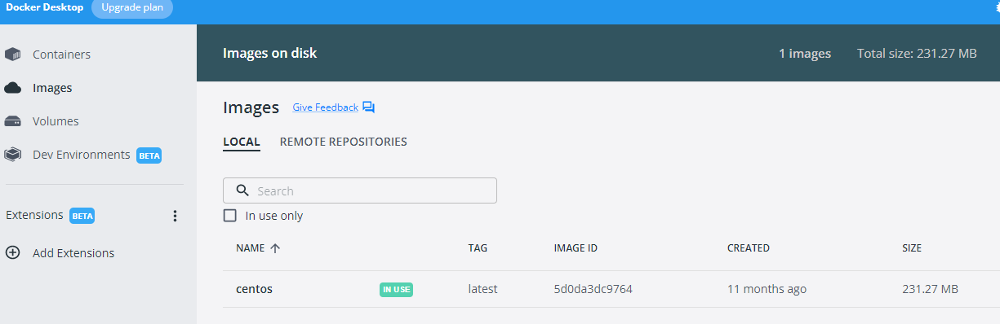

## [DockerHub] 
도커데스크탑에서 쓸수있는 앱과 플러그인을 다운 받을 수 있다.
  
### 사용목적
Cent OS 이미지 다운로드.

### 사용방법
1. dockerHub 페이지에 접속한다. https://hub.docker.com/
2. 검색창에 'centos' 검색
3. docker 명령어 복사
4. cmd 프로그램에서 복사한 명령어 실행
5. 도커데스크탑에서 확인
 